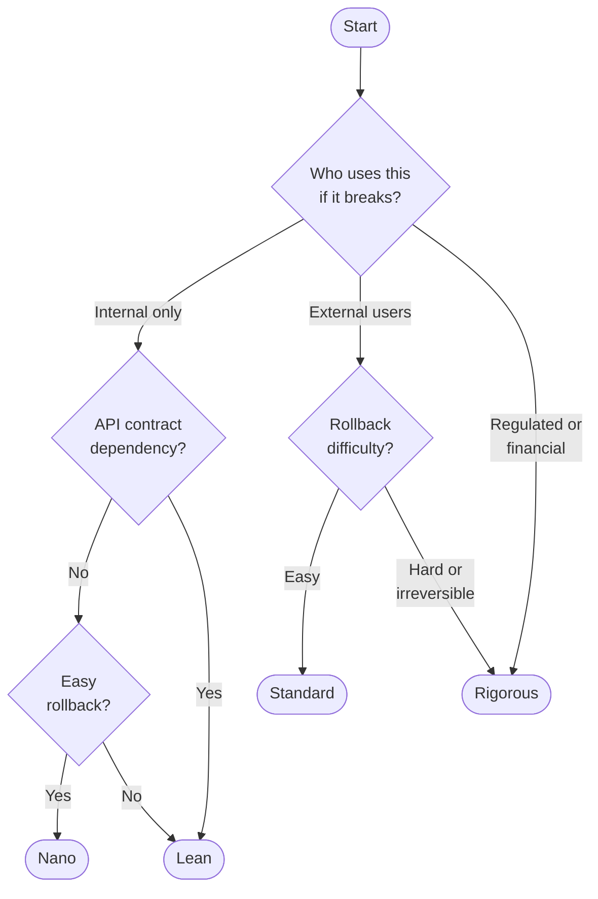

# Quickstart — find your entry point

This is a reference card, not a document. Use it when you have work to do and need to know where to start.

---

## Mode selection — at a glance



Not sure? Tell the orchestrator what you're building — it asks three questions and derives the mode.

---

## Step 1: Pick a mode

Every pipeline run operates in a mode. Say it upfront or let the orchestrator derive it.

| Say this | Mode | What it means |
|----------|------|--------------|
| "nano mode" / "quick fix" / "internal tool" | **Nano** | 2–4 hrs, 4–5 skills, advisory + security hard stops |
| "lean mode" / "standard feature" / "build this properly" | **Lean** | 1–2 days, 8–10 skills, standard gates |
| "standard mode" / "customer-facing" / "external API" | **Standard** | 3–5 days, 16–18 skills, hard gates |
| "rigorous mode" / "payments" / "auth" / "regulated" | **Rigorous** | 1–2 weeks, all skills, sign-off required |
| "hotfix" / "production is down" | **Hotfix path** | Skip planning, straight to Stage 3 |
| "explore" / "spike" / "proof of concept" | **Spike path** | 2–4 hrs, decision only, no prod code |
| "inherited codebase" / "taking over" | **Brownfield path** | Assess before building |

Not sure? Tell the orchestrator what you're building and it will ask 3 questions to derive the mode.

Full mode guide with worked examples: `docs/modes.md`

---

## Step 2: Pick a track (optional)

Tracks are domain overlays. Zero tracks is valid and common. Declare a track when the domain has genuinely different mandatory skills or gate criteria.

| Say this | Track | Adds |
|----------|-------|------|
| "fintech track" / "PCI" / "payment intent" / "payout" | **Fintech** | Idempotency, PCI checklist, reconciliation, fraud signals |
| "saas b2b track" / "multi-tenant" / "SSO" / "SLA" | **SaaS B2B** | Tenant isolation, SSO/SAML, RBAC, metering, enterprise contracts |
| "web product track" / "multi-user web app" / "subscription billing" / "JWT auth" | **Web product** | Auth patterns, lightweight tenant isolation, RBAC, API contract, DB concurrency, Stripe billing, rate limiting, accessibility gate |
| "data platform track" / "data contract" / "schema registry" | **Data platform / ML ops** | Data contracts, schema evolution, data quality, model versioning |
| "healthcare track" / "HIPAA" / "PHI" / "HL7" | **Healthcare** | PHI classification, HIPAA audit log, BAA workflow |
| "regulated track" / "FedRAMP" / "SOC 2" / "CMMC" | **Regulated / government** | Control mapping, evidence library, separation of duties |
| "streaming track" / "Kafka" / "exactly-once" | **Real-time / streaming** | Platform selection, exactly-once, backpressure, windowing |
| "consumer track" / "A/B test" / "content feed" / "push campaign" / "viral loop" | **Consumer product** | Experiment design, event taxonomy, notifications, feed caching, consumer-scale performance |
| "open source track" / "semver" / "CVE disclosure" | **Open source** | Semver discipline, deprecation, VDP, contributor experience |
| "mobile track" / "iOS" / "Android" / "TestFlight" | **Mobile** | Store cycles, version management, offline-first, push, perf |
| "blockchain track" / "smart contract" / "Solidity" / "DeFi" / "Web3" | **Blockchain / Web3** | Smart contract audit, key management, upgrade patterns, oracle security |
| "IoT track" / "firmware" / "embedded" / "OTA update" / "MQTT" | **IoT / Embedded** | Device security, OTA rollback, fleet rollout, edge patterns |
| "gaming track" / "game server" / "matchmaking" / "live ops" | **Gaming** | Multiplayer patterns, IAP flows, latency SLOs, staged rollout |
| "defense track" / "classified" / "ITAR" / "RMF" / "air-gapped" | **Defense / Classified** | ITAR/EAR controls, RMF/ATO, air-gapped deployment |

Multiple tracks compose additively. Declare them together with the mode:
```
"Standard mode, SaaS B2B + Healthcare tracks — build the clinical sharing feature"
```

Or let the orchestrator suggest one from PRD keywords — it asks for confirmation before activating.

Full track guide: `docs/tracks.md`

---

## Step 3: What do you have right now?

| Starting point | Go here first |
|----------------|---------------|
| An idea or feature request | `prd-creator` |
| A PRD or spec, but no design | `design-doc-generator` |
| A design, but no code | `code-implementer` |
| Code that needs review | `code-review-quality-gates` |
| Something broke in production | `incident-postmortem` → hotfix path |
| A schema migration to run | `database-migration` |
| Ready to release | `release-readiness` |
| Measuring delivery health | `delivery-metrics-dora` |
| Project is finishing | `project-closeout` |
| New feature from scratch, not sure which skill | `sdlc-orchestrator` (it will route you) |

---

## Minimum viable Phase 1 (under 2 hours) — Lean mode

You have a feature idea and 2 hours. Do this and nothing else:

1. **`prd-creator` — Mode A (20 min)**: define the problem, users, goals, NFRs. Output: one-page PRD.
2. **`requirements-tracer` (30 min)**: decompose the PRD into 3–5 stories with BDD acceptance criteria.
3. **`design-doc-generator` (45 min)**: high-level design, key decisions, API contracts. Output: `DESIGN.md`.
4. **Stop.** Hand off to `code-implementer`.

Skip everything else in Phase 1 unless you have a specific reason. Those skills exist for higher-risk, higher-complexity work.

---

## Pipeline shortcuts

| Situation | Skip | Use instead |
|-----------|------|-------------|
| Bug fix under 1 day | Phases 1–2 planning | Hotfix path in `sdlc-orchestrator`, then PR |
| Exploring an approach | Full pipeline | Spike path in `sdlc-orchestrator` (2–4 hrs) |
| Minor feature, no API changes | Full spec | `prd-creator` → `code-implementer` |
| System under active incident | Everything else | `incident-postmortem` + hotfix path |
| Flag cleanup or rollout | Phase 1, code review | `feature-flag-lifecycle` standalone |
| Taking over existing codebase | Standard pipeline | Brownfield path first, then pick mode (and any tracks that apply) |
| Project handover to client | Code tasks | `project-closeout` standalone |

---

## When to use each phase

**Phase 1 — Foundation**: figure out what you're building and why before writing code. Skip for bug fixes and minor changes. Required for anything with API contracts, NFRs, or design decisions that will be hard to reverse.

**Phase 2 — Delivery quality**: day-to-day implementation standards. Cannot be skipped; applies at different granularities depending on mode (Nano: 3 skills, Lean: 6–8, Standard/Rigorous: all).

**Phase 3 — Sustained operations**: post-go-live health — incident postmortems, DORA metrics, technical debt, dependency hygiene, chaos engineering. Apply after go-live on a regular cadence.

**Phase 4 — Advanced assurance**: formal verification for distributed protocols. Critical systems only, and only when you're designing a custom protocol that cannot rely on a proven library.

---

## All trigger phrases

Looking for the natural language that fires a specific skill? See `docs/skill-triggers.md`.
