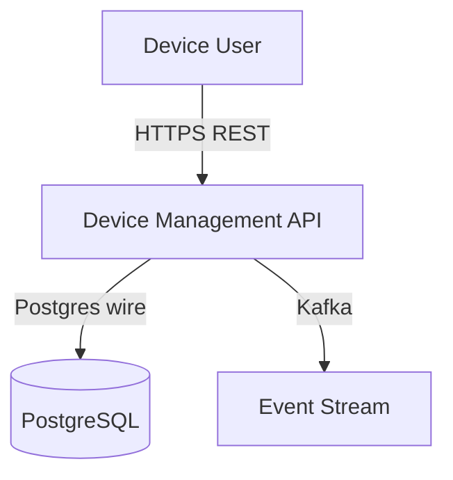
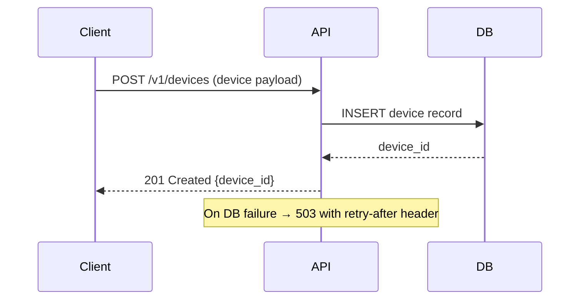

# Design document generator

## Purpose

A technical design document bridges the gap between what to build (the PRD and requirements) and how to build it (implementation). It defines components, data flows, API contract summaries, data models, infrastructure, and an ordered implementation plan. When this document is complete and approved, the `code-implementer` skill has everything it needs to begin writing code without requiring further clarification.

This skill synthesises outputs from multiple upstream skills into a single coherent document:

| Upstream input | Provides |
|---|---|
| `PRD.md` (prd-creator) | Problem context, goals, NFRs, constraints |
| Traceability matrix (requirements-tracer) | Feature list, acceptance criteria, BDD scenarios |
| API specs (specification-driven-development) | Contract definitions, endpoint signatures, schemas |
| ADRs (architecture-decision-records) | Architectural decisions already made |
| Architecture review findings (architecture-review-governance) | Constraints and anti-patterns to avoid |

---

## When to use

- After PRD is approved and requirements are traced — use the full pipeline inputs
- When an approved spec exists and you need a design doc to implement against
- When a stakeholder has delivered specs and you need to design the consuming system
- When an architecture review has concluded and decisions need to be translated into a build plan
- When the team is about to start implementation and there is no shared design reference

---

## When NOT to use

- Before a PRD exists — go to `prd-creator` first
- Before requirements are decomposed — go to `requirements-tracer` first
- For a design decision that needs recording but not a full doc — use `architecture-decision-records`
- For reviewing an existing design — use `architecture-review-governance`

---

## Process

1. Verify the inputs checklist below. If required inputs are missing, flag them explicitly and direct the user to the upstream skill. Do not start the design doc until required inputs exist.
2. Read the PRD for context, goals, NFRs, and constraints. Highlight the NFRs — every one must have a named design mechanism by the end of this process.
3. Read the traceability matrix to understand the full story list. Every story must map to at least one data flow in Section 3.
4. Read all API specs. Do not re-define specs in the design doc — reference them by file path. The design doc explains how components use the contracts, not what the contracts are.
5. Read existing ADRs. Note any architectural constraints they impose — these are non-negotiable in the design.
6. Write Section 1 (Context): what this design is for, what is in scope, what is out of scope, which ADRs are already made.
7. Write Section 2 (Components): system context diagram, component table, and key logic / failure mode notes for each component.
8. Write Section 3 (Data flows): one sequence diagram per primary user flow, linked to its Story ID. Include the error path for each flow.
9. Write Section 4 (Data and security): data models with index rationale, security checkpoint (5 questions — required in Lean and above), STRIDE threats and mitigations (Standard and above), NFR-to-mechanism mapping. Do not leave any security checkpoint answer as "TBD".
10. Write Section 5 (Implementation phases): ordered phases, each independently deployable, each with scope, story IDs, dependencies, test approach, documentation deliverable, and exit criteria.
11. Run the design review gate checklist (see below). Resolve any failures before handing off to `code-implementer`.
12. Append the execution log entry.

## Inputs checklist

Verify these exist before generating the design doc. Flag any that are missing.

| Input | Required | Source skill |
|-------|----------|-------------|
| `PRD.md` (approved) | Required | prd-creator |
| Functional requirements list | Required | requirements-tracer |
| NFR list | Required | PRD section 7 |
| API contract specs (OpenAPI / Protobuf / AsyncAPI) | Required if APIs exist | specification-driven-development |
| ADR index | Recommended | architecture-decision-records |
| Architecture review report | Recommended | architecture-review-governance |
| Existing system architecture (for integrations) | Required if integrating | documentation-system-design |

---

## Design document structure

Five sections. Every section is required. Keep each section to what an engineer actually needs to implement — not comprehensive documentation of every decision.

If a section has unresolved questions, capture them inline as `> **Open:** [question] — owner: [name], deadline: [date]`. No implementation may begin for a component with an unresolved question that affects its design.

---

### Section 1: Context

- What is this design for? (link to PRD)
- What is in scope for this design? (which features/stories)
- What is explicitly out of scope?
- Which decisions are already made? (list ADR references)

Keep this short. One paragraph plus a bullet list of ADRs is usually enough.

---

### Section 2: Components

A system context diagram showing the component in relation to its environment. Render as ASCII or Mermaid. Label all arrows with protocol and data type.



For each major component:

| Component | Responsibility | Technology |
|-----------|---------------|------------|
| Component name | What it does in one sentence | Language, framework |

Then for each component that has non-obvious logic:
- **Key logic:** Non-obvious processing decisions (with ADR reference)
- **Failure modes:** What happens when it fails, how it recovers

---

### Section 3: Data flows

For each primary user flow, a sequence diagram linked to its Story ID. Include the error path.



Also reference API contracts — do not redefine specs here:

| API surface | Spec file | Design notes |
|-------------|-----------|-------------|
| Device API | `specs/device-api.yaml` | Auth: JWT. Versioning: URI prefix. |

---

### Section 4: Data and security

**Data models** — for each persistent entity:

```
Entity: Device  |  Table: devices
| Column         | Type         | Constraints        | Notes                    |
| id             | UUID         | PK, not null       | Server-generated         |
| tenant_id      | UUID         | FK, not null       | Multi-tenancy key        |
| status         | ENUM         | not null           | registered/active/inactive |
| registered_at  | TIMESTAMPTZ  | not null           | UTC                      |
```

Include index rationale and migration strategy for any changes to existing tables.

**Security checkpoint — 5 questions (required in Lean and above; answer all five before Stage 3 starts)**

These questions must be answered explicitly. "TBD" or "to be decided during implementation" is not an accepted answer — implementation cannot begin on a component with an unanswered security question that affects its design.

| # | Question | What a good answer looks like |
|---|---------|------------------------------|
| 1 | What data does this feature handle? | Classify each data element: public / internal / PII / financial / regulated. List any that are PII or regulated. |
| 2 | Who is allowed to call this? | Name the auth model exactly: unauthenticated / API key / JWT with claims / session cookie / OAuth scope. Name the authorisation model: open / RBAC role / ownership check. |
| 3 | What happens on auth failure? | HTTP 401 or 403 returned; no data in the error body that reveals internal state; no timing difference between "user not found" and "wrong password". |
| 4 | What are the injection surfaces? | List every DB query, shell command, and template render in scope. State explicitly whether each is parameterised / using argument arrays / auto-escaped. |
| 5 | Can a request be replayed or double-submitted? | State explicitly: idempotency key present, or deduplicated by DB constraint, or replay is acceptable because the operation is read-only. |

If any answer is "we don't know yet", that is a blocker. Resolve it before Stage 3.

**STRIDE threats and mitigations** (Standard and above — Lean uses the 5-question checkpoint above):

| Threat | Component | Mitigation |
|--------|-----------|-----------|
| Spoofing | API | JWT validation, key rotation |
| Tampering | DB | Role-based access, audit log |

List authentication mechanism, authorisation model, secrets management approach, and audit logging requirements.

**NFR design mechanisms** — map each NFR to its design answer:

| NFR | Design mechanism |
|-----|-----------------|
| p99 < 200ms at 1k rps | Index on tenant_id+status; async event publish |
| 99.9% uptime | Horizontal scaling; health check + restart |

---

### Section 5: Implementation phases

Break implementation into ordered phases. Each phase must be independently deployable — if a phase cannot be deployed and demonstrated on its own, split it.

**Phase 1: [Name]**
- Scope: [what this phase delivers]
- Stories covered: [ST-NNN list]
- Dependencies: [what must exist before this phase starts]
- Test approach: [what unit, integration, and acceptance tests will verify this phase — be specific, not "write tests"]
- Documentation: [what docs must be updated when this phase is complete — API reference, runbook stub, README env vars, etc.]
- Exit criteria: [what must be true to call this phase complete — includes tests passing and docs updated]

**Phase 2: [Name]**
...

Rule: never start a phase until the previous phase's exit criteria are met.

---

## Design review gate

Before the design doc exits this skill and enters `code-implementer`, it must pass:

- All 5 sections present and complete
- Every user story is covered by at least one data flow
- Every NFR has a named design mechanism
- Every implementation phase has a defined test approach (not generic — names what will be tested and how)
- Every implementation phase has a defined documentation deliverable
- No open questions without an owner and deadline
- **Security checkpoint answered (Lean and above):** all 5 questions in Section 4 have explicit answers — no "TBD"; no "decide during implementation"
- Architecture self-review checklist run (from `architecture-review-governance`) — Standard and above
- STRIDE threats documented with mitigations — Standard and above

---

## Output format

The design document is produced as `DESIGN.md` in the project documentation directory.

Header:
```markdown
# Design document: [Feature/System name]

**Version:** 1.0
**Status:** Draft | Approved
**PRD:** [link to PRD.md]
**ADRs:** [ADR-NNN list]
**Author:** [Name]
**Date:** [YYYY-MM-DD]
```

---

## Handoff to next stage

Once the design doc is approved:

1. Pass `DESIGN.md` to `code-implementer` as the primary implementation spec
2. Record any significant decisions made during design as ADRs (`architecture-decision-records`)
3. Seed the risk register with any risks identified during design (`technical-risk-management`)

---

## Skill execution log

When this skill fires, append one line to `docs/skill-log.md` before doing anything else:

```
[YYYY-MM-DD] design-doc-generator — [one-line description of what was triggered]
```

If `docs/skill-log.md` does not exist yet, create it with the header defined in the `sdlc-orchestrator` skill.

Example entries:
```
[2026-04-20] design-doc-generator — DESIGN.md produced for device telemetry ingestion
[2026-04-20] design-doc-generator — Design revised after Stage 2 gate; ADR-009 created
```

---

## Reference files

- `references/design-doc-template.md` — Blank design document template
- `references/design-doc-quality-checklist.md` — Gate checklist before entering code-implementer
- `references/inputs-guide.md` — How to read and use PRD, specs, and ADRs as design inputs
