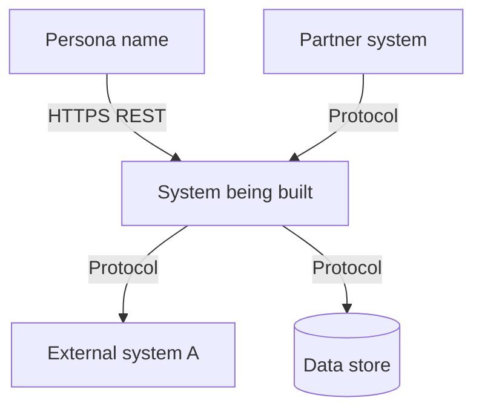
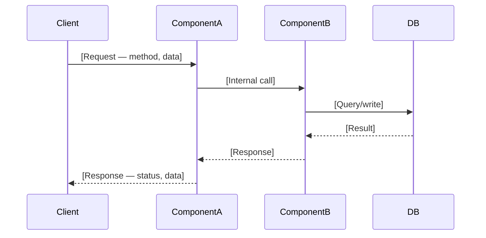

# Design document template

Copy this template to `DESIGN.md` in your project documentation directory. Fill every section. Reference upstream artifacts (PRD, specs, ADRs) rather than duplicating their content.

---

```markdown
# Design document: [Feature / System name]

**Version:** 1.0
**Status:** Draft
**PRD reference:** [Link to PRD.md]
**Stories covered:** [ST-NNN, ST-NNN, ...]
**ADRs referenced:** [ADR-NNN: Title, ADR-NNN: Title]
**Author:** [Name]
**Architecture reviewer:** [Name — required before Approved status]
**Security reviewer:** [Name — required before Approved status]
**Date created:** [YYYY-MM-DD]
**Date approved:** —
**Next stage:** code-implementer

---

## 1. Overview and context

**What this design covers:**
[2-3 sentences. What feature/system is being designed? Which user stories does it implement?]

**What this design does NOT cover:**
[Explicit exclusions to prevent scope confusion]

**Decisions already made (ADR references):**
- ADR-NNN: [Decision title — link]
- ADR-NNN: [Decision title — link]

**Key constraints from PRD:**
- [Constraint from PRD section 8 that shapes this design]
- [NFR from PRD section 7 that drives architectural choices]

---

## 2. System context diagram

[C4 Level 1: Show the system being built in relation to users and external systems.]
[Use Mermaid or ASCII. Label every arrow with protocol and data type.]



**Key integration points:**
| System | Protocol | Data exchanged | Owner |
|--------|----------|---------------|-------|
| [System name] | HTTPS REST | [What data] | [Company] |
| [System name] | Kafka | [Topic name, event type] | [Company] |

---

## 3. Component design

### Component map

| Component | Responsibility | Technology | Owner team |
|-----------|---------------|------------|-----------|
| [Name] | [One sentence — what it does] | [Language, framework] | [Team] |
| [Name] | | | |

### Component details

#### [Component name]

**Responsibility:** [What this component is responsible for — be specific]

**Inputs:**
- [Request type / event / trigger — format, source]
- [...]

**Outputs:**
- [Response / event / side effect — format, destination]
- [...]

**State:**
- [What persistent state this component owns]
- [Where it is stored (DB table, cache, etc.)]

**Key logic:**
- [Non-obvious processing decision — reference ADR if one exists]
- [...]

**Failure modes:**
| Failure | Detection | Recovery |
|---------|-----------|----------|
| [What fails] | [How it's detected] | [How it recovers] |

---

#### [Next component — repeat above structure]

---

## 4. Data flows

[One sequence diagram per primary user flow. Map each flow to a Story ID.]

### Flow 1: [Flow name] (ST-NNN)

[Describe the flow in 1-2 sentences.]



**Data at each step:**
| Step | Data in | Data out | Format |
|------|---------|---------|--------|
| Client → ComponentA | [fields] | — | JSON / Protobuf / etc. |
| ComponentA → DB | [fields] | — | SQL |

**Error paths:**
| Step | Error condition | Response | Recovery |
|------|----------------|---------|----------|
| Client → ComponentA | Invalid auth token | 401 Unauthorized | Client must re-authenticate |

---

### Flow 2: [Flow name] (ST-NNN)
[Repeat structure above]

---

## 5. API contracts summary

[Reference specs — do not duplicate them. This section is a navigation index.]

| API surface | Spec file | Key operations | Notes |
|-------------|-----------|---------------|-------|
| [API name] | `specs/[filename]` | [Method + path list] | [Versioning, auth mechanism] |

**API design decisions not captured in spec:**
- [Versioning strategy: e.g., URL versioning /v1/...]
- [Auth mechanism: e.g., Bearer JWT, scoped per tenant]
- [Rate limiting: e.g., 1,000 req/min per API key]
- [Pagination: e.g., cursor-based, max page size 100]

---

## 6. Data models

### [Entity name]

**Table:** `[table_name]`
**Purpose:** [What this entity represents]

| Column | Type | Constraints | Notes |
|--------|------|-------------|-------|
| id | UUID | PK, NOT NULL | Generated server-side (uuid_generate_v4()) |
| [column] | [type] | [constraints] | [notes] |

**Indexes:**
| Index name | Columns | Type | Serves query |
|------------|---------|------|-------------|
| idx_[table]_[col] | [col] | B-tree | GET /[entity] filtered by [col] |

**Relationships:**
- [Entity] belongs to [Entity] via [foreign key]
- [Entity] has many [Entity] via [join table]

**Migration strategy:**
- [Is this a new table? Additive column? Modifying existing column?]
- [Is the migration backward compatible? Can the current deployed version run alongside this?]
- [Rollback: is the migration reversible?]

---

## 7. Infrastructure requirements

| Resource | Type | Sizing | Scaling strategy | Notes |
|----------|------|--------|-----------------|-------|
| [Service name] | Container / VM / Serverless | [CPU, memory] | [Horizontal / vertical / none] | [Stateless? Dependencies?] |
| [Database name] | [Managed / self-hosted] | [Instance type] | [Read replicas / sharding] | [Connection pooling?] |
| [Queue/stream] | [Kafka / SQS / etc.] | [Partitions / capacity] | [Auto-scaling policy] | [Retention period] |

**Network topology:**
- [Which components can reach which — be explicit about what is NOT reachable across the trust boundary]

**Environment configuration:**
| Variable | Description | Required | Default | Sensitive |
|----------|-------------|----------|---------|-----------|
| [VAR_NAME] | [What it controls] | Yes / No | [value or "none"] | Yes / No |

**Secrets management:**
- [How secrets are stored and accessed — reference security-audit-secure-sdlc]

---

## 8. Security considerations

[Reference the STRIDE threat model produced by security-audit-secure-sdlc. Summarise mitigations here.]

| Threat category | Component | Threat | Mitigation | ADR |
|----------------|-----------|--------|-----------|-----|
| Spoofing | API gateway | Unauthenticated requests | JWT validation, API key rotation | ADR-NNN |
| Tampering | Database | Unauthorised data modification | RBAC, audit log | ADR-NNN |
| Repudiation | All write operations | Deniability of mutations | Immutable audit log | ADR-NNN |
| Information disclosure | API responses | Sensitive data leakage | Response field filtering, no stack traces | — |
| Denial of service | API | Request flooding | Rate limiting at gateway | — |
| Elevation of privilege | API | Tenant data cross-access | Tenant isolation at query level | ADR-NNN |

**Authentication:** [Mechanism — JWT, API key, mTLS, etc.]
**Authorisation model:** [RBAC / ABAC / tenant isolation / etc.]
**Data classification:** [Which fields are PII, sensitive, or regulated]
**Audit logging:** [What events are logged, where, retention period]

---

## 9. Performance and reliability design

[Map each NFR from PRD section 7 to a specific design mechanism.]

| NFR ID | Requirement | Design mechanism | Where to verify |
|--------|-------------|-----------------|----------------|
| NFR-001 | [Requirement from PRD] | [How the design meets it] | [Test file or monitoring metric] |
| NFR-002 | | | |

**Circuit breakers:**
| Caller | Called | Threshold | Fallback |
|--------|--------|-----------|---------|
| [Component] | [Dependency] | [e.g., 50% error rate over 30s] | [e.g., return cached result] |

**Retry policies:**
| Operation | Retry count | Backoff | Idempotent? |
|-----------|------------|---------|------------|
| [Operation] | [N] | [Exponential / fixed, max Xms] | Yes / No |

**Timeout configurations:**
| Connection | Timeout | Notes |
|------------|---------|-------|
| API → DB | [Xms] | |
| API → External service | [Xms] | |

---

## 10. Implementation phases

[Break implementation into independently deployable phases. Each phase should be demonstrable on its own.]

### Phase 1: [Phase name]

**Scope:** [2-3 sentences describing what is implemented in this phase]

**Deliverables:**
- [Specific artifact — e.g., "POST /v1/devices endpoint, fully tested"]
- [...]

**Prerequisites:** [What must exist before Phase 1 can start]

**Exit criteria:**
- [ ] [Specific verifiable condition]
- [ ] All unit and integration tests pass
- [ ] Acceptance scenarios [ST-NNN, ST-NNN] pass
- [ ] Phase can be deployed without breaking existing functionality

**Stories covered:** [ST-NNN, ST-NNN]

**Estimated scope:** [S / M / L / XL — rough sizing only]

---

### Phase 2: [Phase name]

**Prerequisites:** Phase 1 complete and deployed

[Repeat structure above]

---

## 11. Open questions and decisions required

[No implementation may begin for a component with an unresolved question that affects its design.]

| # | Question | Owner | Deadline | Impact if unresolved |
|---|----------|-------|----------|---------------------|
| DQ-001 | [Question] | [Name] | [Date] | [What is blocked] |

---

## Approval

| Role | Name | Decision | Date | Notes |
|------|------|----------|------|-------|
| Engineering lead | | Approved / Changes requested | | |
| Architecture reviewer | | Approved / Changes requested | | |
| Security reviewer | | Approved / Changes requested | | |
| Partner company reviewer | | Approved / Changes requested | | |

**Status after approval:** Ready to enter implementation (Stage 5 of SDLC pipeline)
```
